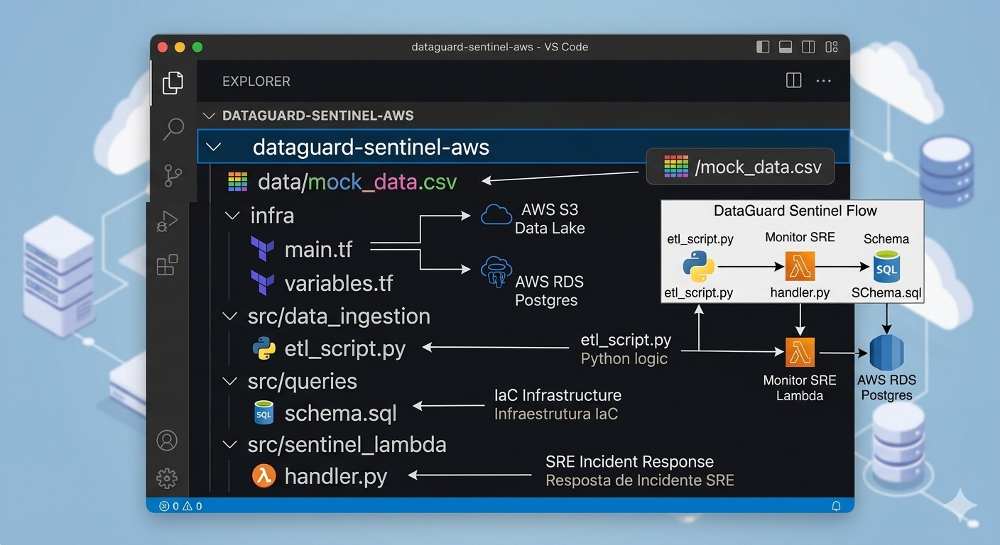
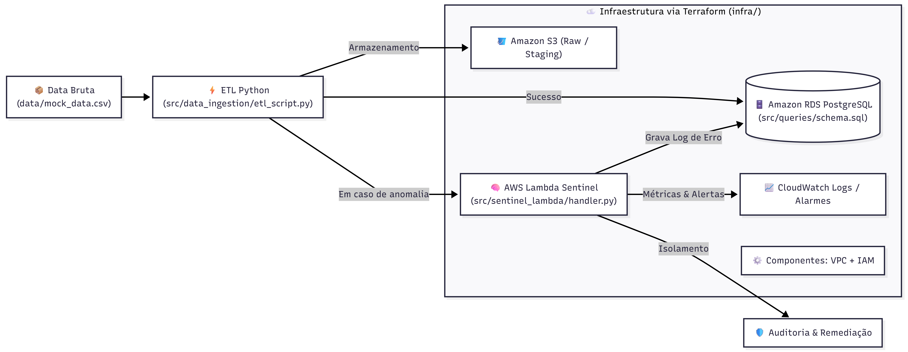

  
  
  
  
  
  

<h2 align="center">✨ DataGuard Sentinel AWS ✨</h2>

  Este projeto representa um pipeline automatizado de observabilidade de dados e autocorreção de incidentes de ponta a ponta, meticulosamente desenvolvido sob uma abordagem rigorosa de DataOps e Site Reliability Engineering (SRE) em ambiente cloud-native. A arquitetura orquestra o provisionamento declarativo de infraestrutura como código (IaC) via Terraform, isolando redes e recursos analíticos na AWS de forma reprodutível e segura. O núcleo da aplicação combina um motor ETL assíncrono em Python com o driver de alta performance Psycopg 3, responsável pela ingestão, sanitização e validação de payloads em tempo real, persistindo dados analíticos em um cluster Amazon RDS PostgreSQL estruturado com índices B-Tree otimizados (incluindo chaves primárias baseadas em UUIDv7 ordenáveis por tempo). Paralelamente, uma camada de inteligência serverless baseada em AWS Lambda atua como o componente Sentinel, monitorando a saúde operacional do fluxo, isolando anomalias transacionais, aplicando políticas de Data Quality e disparando mechanisms automatizados de remediação e auditoria para garantir a máxima confiabilidade do ecossistema de dados.

---

## 🔥 Features

- ⚡ **Infraestrutura Declarativa (IaC)**: Ciclo de vida completo de recursos analíticos (VPC, RDS, S3, IAM Roles) automatizado via Terraform.
- 🧠 **Observabilidade e Data Quality**: Monitoramento proativo de cargas úteis (payloads) para identificação instantânea de anomalias e quebras de schema.
- 🗄️ **Arquitetura de Alta Performance**: Modelagem relacional avançada no PostgreSQL com otimização de índices e chaves primárias sequenciais cronológicas via UUIDv7.
- 🚀 **Inteligência Serverless SRE**: Camada resiliente acionada via AWS Lambda para isolamento de incidentes, rastreabilidade e análise de causa raiz.
- 📡 **Conectividade Secura**: Comunicação criptografada fim a fim com banco de dados em nuvem utilizando conexões seguras via SSL.
- 📊 **Auditoria e Metadados**: Registro estruturado de anomalias transacionais categorizadas por tipo, severidade e detalhamento técnico para governança corporativa.
- ⚙️ **Cultura DataOps**: Alinhamento estrito com os padrões modernos de engenharia de confiabilidade de dados e pipelines autoregenerativos.

---

## 🧠 Mapa Mental Técnico

Esta seção consolida a arquitetura técnica e conceitual do projeto, mapeando diretamente os componentes de código do ecossistema às suas respectivas responsabilidades em Nuvem.

  

---

## 📂 Visão Geral da Estrutura do Projeto

### 1. 🟣 `infra/` — Orquestração de Infraestrutura em Nuvem (`Terraform`)
> 🎨 **Mapeamento de Cor no Diagrama:** `Subgraph com Borda Roxa`
>
> Camada responsável por eliminar o provisionamento manual e mitigar o desvio de configuração (*configuration drift*). Através do `main.tf` e `variables.tf`, o ambiente é descrito de forma totalmente declarativa via **Terraform**, assegurando isolamento de rede, políticas estritas de privilégio mínimo (IAM) e persistência escalável.

### 2. ⚪ `data/` — Camada de Dados Brutos e Sanitização Prévia
> 🎨 **Mapeamento de Cor no Diagrama:** `Caixa de Entrada Cinza/Branca`
>
> Ponto de entrada dos arquivos de telemetria e transações mockadas (`mock_data.csv`). A validação estrutural nesta fase permite inspecionar delimitações, encoding e integridade posicional dos registros antes do início da computação lógica.

### 3. 🔵 `src/data_ingestion/` — Motor ETL de Alta Disponibilidade (`Python`)
> 🎨 **Mapeamento de Cor no Diagrama:** `Bloco Sólido Azul Escuro`
>
> Componente core desenvolvido em **Python** para execução das fases de Extração, Transformação e Carga. Utilizando pipelines assíncronos e barramentos de validação de tipos, o script barra corrupções de dados em tempo de execução e garante consistência transacional antes da escrita física no banco de dados.

### 4. 🟠 `src/sentinel_lambda/` — Engine Serverless de Auto-Healing (`AWS Lambda`)
> 🎨 **Mapeamento de Cor no Diagrama:** `Bloco Sólido Marrom/Laranja`
>
> Função orientada a eventos (`handler.py`) projetada sob princípios SRE e hospedada na **AWS Lambda**. O componente atua na mitigação de falhas do pipeline, capturando exceções de hardware ou software, gerando logs de auditoria detalhados no CloudWatch e orquestrando o fluxo de isolamento do dado corrompido sem interromper o processamento global.

### 5. 🔵 `src/queries/` — Camada de Governança e Persistência Relacional (`PostgreSQL`)
> 🎨 **Mapeamento de Cor no Diagrama:** `Cilindro de Banco de Dados Azul`
>
> Repositório dos esquemas de dados (`schema.sql`) aplicados no **Amazon RDS PostgreSQL**. Consolida regras rígidas de integridade referencial, constraints de chaves estrangeiras, tratamento de concorrência e estratégias avançadas de indexação B-Tree para consultas analíticas sub-milissegundo.

---

## 🔄 Fluxo de Dados End-to-End

O pipeline segue um fluxo estruturado de triagem de carga útil, monitoramento de saúde operacional e isolamento reativo de dados corrompidos.

### Arquitetura do Pipeline (Color Coding)

  

### Dinâmica de Interações e Conectividade (Quadro Branco)

  

---

## 📊 Linha de Execução e Evidências Operacionais (SRE)

Abaixo está documentado o comportamento cronológico do ecossistema durante uma janela de ingestão de dados, validando o isolamento de falhas e a persistência final no ambiente AWS RDS.

  <code>Etapa 1: Leitura CSV</code> ──> <code>Etapa 2: Intercepção TRX002</code> ──> <code>Etapa 3: Gravação SSL</code> ──> <code>Etapa 4: Auditoria Relacional</code>

| Fase de Execução | Descrição Operacional |
| :--- | :--- |
| **1. Triagem e Captura** | O script Python realiza o parsing do arquivo e localiza uma anomalia de tipo crítico no registro `TRX002`. O motor Sentinel captura a falha e isola o payload inválido instantaneamente. |
| **2. Comunicação Secura** | Utilizando o driver Psycopg 3 protegido por chaves criptográficas SSL, o sistema faz o bypass seguro das proteções de borda para gravar o incidente no cluster. |
| **3. Conclusão do Pipeline** | A consulta analítica via console comprova a integridade e governança da operação, listando a causa raiz e o nível de severidade. |

  

---

  <b>Status: Conectado, Mapeado e Operacional na AWS Cloud.</b>

