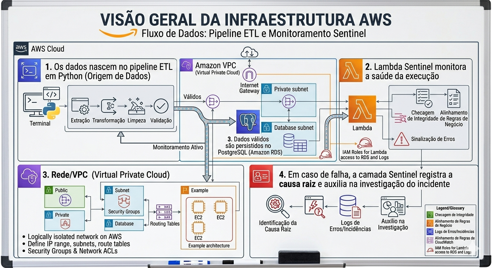
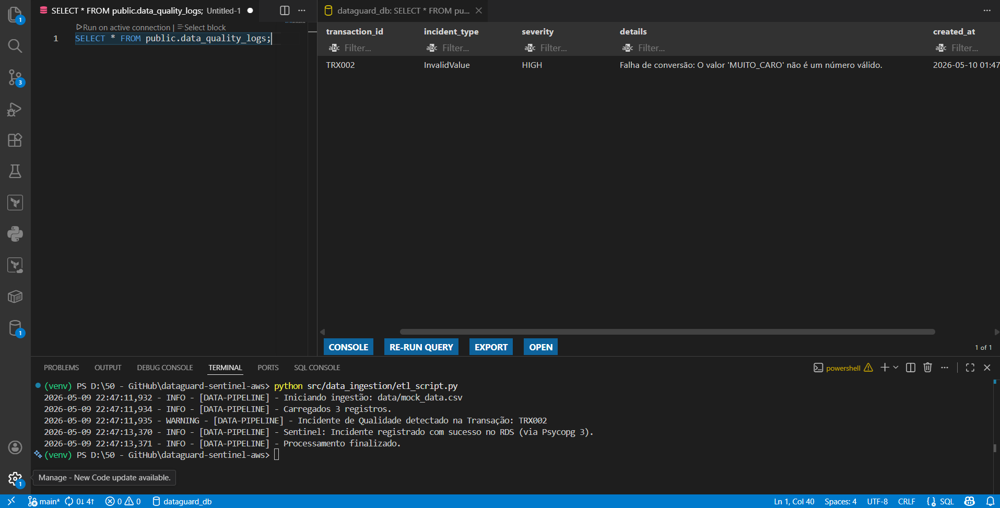

# dataguard-sentinel-aws
Automated Data Observability Pipeline with Incident Auto-Healing on AWS using Python, SQL, and Terraform (DataOps/SRE approach).

## 🧠 Mapa Mental Técnico

Esta imagem representa a arquitetura mental e técnica do projeto.  
Ela conecta as pastas criadas no VS Code com os serviços da AWS e com as responsabilidades esperadas de um Engenheiro de Dados moderno.

---

# 📂 Visão Geral da Estrutura do Projeto

## 1. `infra/` — Esqueleto da Infraestrutura em Nuvem

### `main.tf` e `variables.tf`

Esta camada utiliza Terraform para provisionar infraestrutura como código (IaC).  
Em vez de criar recursos manualmente no Console da AWS, toda a infraestrutura é descrita de forma declarativa.

Exemplos:
- Amazon RDS
- Buckets S3
- Rede/VPC
- IAM Roles

### Por que isso importa?

Demonstra:
- Infraestrutura como Código (IaC)
- Reprodutibilidade de ambientes
- Arquitetura escalável em nuvem
- Boas práticas de DevOps/DataOps

---

## 2. `data/` — Camada de Dados Brutos

### `mock_data.csv`

Contém dados fictícios que simulam informações reais recebidas de clientes.

### Rainbow CSV

A visualização colorida do CSV ajuda a identificar:
- linhas mal formatadas
- problemas de encoding
- colunas ausentes
- inconsistências de delimitadores

antes mesmo do início da ingestão de dados.

---

## 3. `src/data_ingestion/` — Motor ETL

### `etl_script.py`

Pipeline ETL em Python responsável por:
- extrair dados CSV
- limpar e validar registros
- aplicar regras de transformação
- carregar os dados no PostgreSQL

### Camada de Confiabilidade

Se dados inválidos forem detectados (ex.: preços mal formatados ou tipos incorretos), o script registra o erro para a camada de monitoramento Sentinel.

---

## 4. `src/sentinel_lambda/` — Camada de Inteligência SRE

### `handler.py`

Função AWS Lambda responsável por monitorar a execução do pipeline e automatizar respostas a incidentes.

### Responsabilidades

- Detectar falhas no ETL
- Gerar logs detalhados
- Monitorar o fluxo de execução
- Disparar alertas
- Auxiliar na análise de causa raiz

### Valor Técnico

Demonstra:
- Site Reliability Engineering (SRE)
- Monitoramento serverless
- Automação de resposta a incidentes
- Observabilidade cloud-native

---

## 5. `src/queries/` — Camada de Governança de Dados

### `schema.sql`

Define a estrutura do banco PostgreSQL, incluindo:
- tabelas
- relacionamentos
- constraints
- estratégia de índices

### Por que isso importa?

Dominar SQL e modelagem de dados é essencial para Engenharia de Dados.

Esta camada demonstra:
- modelagem relacional
- governança de esquema
- integridade de dados
- design de banco de dados

---

# 🔄 Fluxo do DataGuard Sentinel

A arquitetura representada no quadro branco segue o seguinte fluxo:

1. Os dados nascem no pipeline ETL em Python.
2. A Lambda Sentinel monitora a saúde da execução.
3. Dados válidos são persistidos no PostgreSQL (Amazon RDS).
4. Em caso de falha, a camada Sentinel registra a causa raiz e auxilia na investigação do incidente.

# Resumo de Execução: DataGuard Sentinel AWS

Esta imagem representa o sucesso da integração "end-to-end" do projeto, unindo infraestrutura como código, desenvolvimento backend e monitoramento de dados.

## O que a imagem demonstra (Visão Técnica)

1.  **Ingestão e Validação (Terminal):**
    * O script Python (`etl_script.py`) executou a leitura de um arquivo CSV mockado.
    * O motor do **Sentinel** identificou uma anomalia na transação `TRX002` (valor inválido detectado).
    * Utilizando o driver **Psycopg 3**, o script estabeleceu uma conexão segura via SSL com o **AWS RDS** e persistiu o incidente.

2.  **Infraestrutura e Conectividade (SQLTools):**
    * À esquerda, vemos a interface de consulta conectada ao banco de dados provisionado via **Terraform**.
    * A conexão está validada e ativa, operando com as políticas de segurança (Security Groups) configuradas corretamente na AWS.

3.  **Persistência e Data Quality (Console de Resultados):**
    * À direita, o resultado do `SELECT` confirma que o incidente foi gravado com sucesso.
    * Os metadados incluem o `transaction_id`, o tipo de incidente (**InvalidValue**), a severidade (**HIGH**) e o detalhamento técnico do erro.

## Conclusão do Pipeline
O ciclo completo foi validado:
- **Infraestrutura:** Provisionada com Terraform.
- **Segurança:** Acessos e permissões configurados.
- **Aplicação:** Lógica de negócio e tratamento de erro em Python.
- **Banco de Dados:** PostgreSQL (RDS) operando como o repositório central de logs de qualidade.

---
*Status: Conectado e Operacional na AWS.*

---

## ☁️ Tecnologias Utilizadas

- [Python](https://docs.python.org/3/)
- [Terraform](https://developer.hashicorp.com/terraform/docs)
- [AWS Lambda](https://docs.aws.amazon.com/lambda/)
- [Amazon RDS PostgreSQL](https://docs.aws.amazon.com/AmazonRDS/latest/UserGuide/CHAP_PostgreSQL.html)
- [Amazon S3](https://docs.aws.amazon.com/AmazonS3/latest/userguide/Welcome.html)
- [AWS Cloud Infrastructure](https://docs.aws.amazon.com/)
- [ETL Pipelines](https://aws.amazon.com/what-is/etl/)
- [SQL](https://www.postgresql.org/docs/)
- [Serverless Architecture](https://aws.amazon.com/serverless/)
- [Site Reliability Engineering (SRE)](https://sre.google/)
